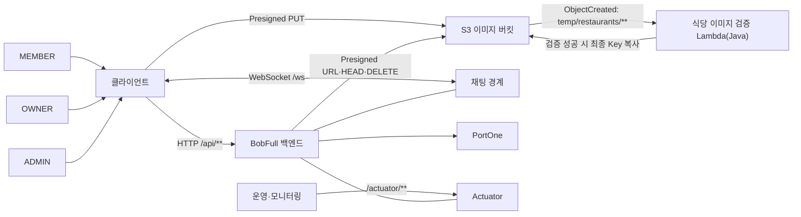
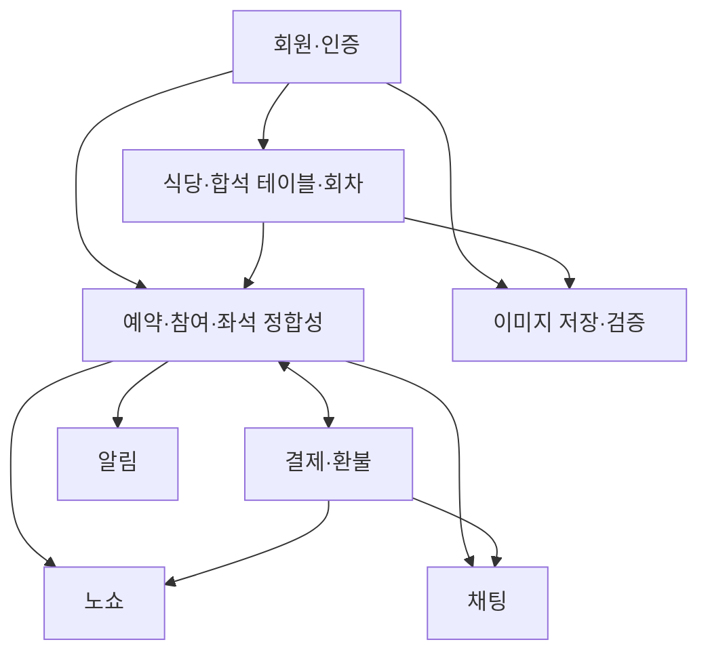

# BobFull 논리 아키텍처

## 1. 목적과 기준

이 문서는 확정된 서비스 계약을 논리 구성 요소와 책임의 관점에서 연결한다. 새 정책이나 기술 선택을 결정하지 않으며, 상세 HTTP 계약과 ERD 컬럼은 원본 문서를 따른다.

기준 문서 우선순위는 다음과 같다.

1. [API 명세](../020-api/bobfull-api-spec-complete.md): HTTP·WebSocket·Actuator 계약
2. [프로젝트 컨텍스트](../010-product/project-context.md): 서비스 정책·역할·버전 범위
3. [ERD](../030-data/erd.md): 영속 데이터·관계·저장값과 계산값

세 문서가 충돌하면 이 문서에서 해석하거나 정책을 정하지 않고 작업을 중단해 Human 판단을 요청한다.

## 2. 시스템 컨텍스트와 경계



- `MEMBER`는 사용자 조회, 본인 예약·참여·결제·환불 조회와 결제 준비를 수행한다.
- `OWNER`는 본인 식당·합석 테이블·회차와 해당 식당의 예약 정보를 관리한다.
- `ADMIN`은 V2의 운영 조회와 V3의 재처리·재집계 범위를 가진다.
- 일반 서비스 HTTP API는 `/api/**`, OWNER·ADMIN 경계는 각각 `/api/owner`, `/api/admin`이다. 채팅 연결은 `/ws`, 운영 상태·모니터링은 `/actuator/**` 경계에 둔다.
- PortOne은 결제 완료 검증과 웹훅 처리의 외부 결제 시스템이다.
- S3 이미지 버킷은 식당 이미지 원본 객체 저장소다. 백엔드는 바이너리를 직접 수신하지 않고 Presigned URL과 Object Key만 다룬다.

## 3. 논리 구성 요소와 의존 관계



| 구성 요소 | 책임 | 기준 데이터·경계 |
|---|---|---|
| 회원·인증 | 역할 식별, 인증 사용자와 본인 리소스 연결 | `Member`, `MEMBER`·`OWNER`·`ADMIN` |
| 식당·합석 테이블·회차 | OWNER 소유 식당, 이미지 Key, 정원, 예약 가능한 회차 관리 | `Restaurant`, `SharedTable`, `TimeSlot` |
| 이미지 저장·검증 | Presigned PUT/GET URL 발급, S3 최종 객체 존재 확인, Lambda 기반 임시 객체 검증·승격 | S3 Object Key, Java Lambda |
| 예약·참여·좌석 정합성 | 최초 예약·추가 참여, 참여 인원·모집·예약 상태 계산 | `Reservation`, `ReservationParticipant`, `TimeSlot` |
| 결제·환불 | 임시 선점, PortOne 검증, 결제·환불 상태 반영 | `Payment`, `Refund` |
| 노쇼 | 식사 종료 후 OWNER의 참여자 단위 처리·해제 이력 | `NoShowHistory` |
| 채팅 | 예약당 채팅방, 유효 참여자 접근, 메시지 저장·조회 | `ChatRoom`, `ChatMessage` |
| AI Moderation Core | ChatMessage 원문 분석 흐름 제어, 결과 검증·저장, Provider 실패 전파 | `ChatModerationService`, `ChatModeration`, `AiModerationPort` |
| Restaurant Feedback Insight | ChatMessage Event를 재사용한 식당 피드백 분석과 OWNER 익명 집계 조회 | `RestaurantFeedbackInsight`, `RestaurantFeedbackItem`, 독립 Kafka Consumer Group |
| Transactional Outbox | 핵심 트랜잭션과 후속 처리 의도 보존, Processor/Scheduler 재시도 | `OutboxEvent`, `EmailOutboxDelivery` |
| Redis | 인증 Refresh Token·Access Token Blacklist, 식당 검색 Cache, 채팅 Pub/Sub 실시간 전달 | Redis key prefix 분리, ERD 엔티티 아님 |
| Kafka | ChatMessage AI Moderation과 Restaurant Feedback Insight 후속 처리 | Outbox 이후 Broker, Consumer Group, Retry/DLT |
| 알림 | 모집 마감 처리 결과(확정·인원 미달 취소)를 유효 참여자에게 이메일로 안내 | 신규 저장 엔티티 없음, `Reservation`/`ReservationParticipant` 조회 결과만 사용 |

## 4. 인증·인가와 소유권 검증

역할 검증만으로 타인 리소스 접근을 허용하지 않는다. MEMBER의 결제 완료 검증은 인증 사용자와 `Payment.memberId`가 일치해야 하며, OWNER는 본인 식당의 식당·테이블·회차·예약만 관리한다. ADMIN 범위는 문서에 명시된 운영 조회·재처리로 제한한다.

PortOne 웹훅은 `POST /api/webhooks/portone`을 `permitAll`·JWT 필터 제외로 열되, 사용자 인증 대신 원본 Body와 `webhook-id`·`webhook-signature`·`webhook-timestamp`의 공식 SDK 서명 검증을 수행한다. JSON 해석은 검증 뒤에만 허용한다. 완료 검증 API와 웹훅은 입구 검증만 분리하고 PortOne 재조회, 동일 Payment 행 비관적 락, 상태·만료 재검증, 예약 확정을 공통 처리로 수렴한다.

### 식당 이미지 저장

OWNER는 백엔드에서 Presigned PUT URL을 발급받아 `temp/restaurants/{ownerId}/{uuid}.{extension}`에 직접 업로드한다. S3 ObjectCreated 이벤트가 Java Lambda를 실행하고, Lambda는 경로·확장자·Content-Type·파일 크기·파일 시그니처를 검증한 뒤 `restaurants/{ownerId}/{uuid}.{extension}`로 복사한다. 별도 상태 조회 API는 두지 않고, 식당 등록·수정 시 최종 객체가 존재하는지 확인한다.

`Restaurant`는 S3 Object Key만 저장한다. 조회 응답의 `imageUrl`은 저장값이 아니라 Presigned GET URL이며, 기존 이미지 교체 시 새 Key 반영이 성공한 뒤 기존 객체를 삭제한다. S3 버킷, 이벤트 알림, Lambda 메모리·Timeout·로그는 배포 문서의 수동 설정 항목을 따른다.

### 인증 세션(Access·Refresh Token)

Access Token은 HS256 JWT로 서명·만료를 검증하는 무상태 토큰이며 서버에 상태를 저장하지 않는다. 다만 발급 시 부여하는 `jti` Claim으로 로그아웃된 토큰만 예외적으로 즉시 폐기할 수 있다(Access Token Blacklist, Issue #186). Refresh Token은 발급·재발급·로그아웃의 폐기가 가능해야 하므로 Redis에만 저장한다(DB 테이블 아님, `docs/050-engineering/code-convention.md` 기준). 회원당 Refresh Token은 항상 1건이며, 로그인·재발급마다 기존 키를 지우고 새로 발급한다(회전). 로그아웃은 인증된 memberId로 그 회원의 Refresh Token 키를 즉시 삭제하고, 그 Access Token의 `jti`를 남은 유효시간만큼 Blacklist에 등록한다. 인증 필터는 서명·만료 검증을 통과한 모든 요청마다 이 Blacklist를 조회해 로그아웃된 토큰을 차단한다. Redis 조회 실패 시 재발급은 새 토큰을 내주지 않고 401로 거부한다. 로그아웃 자체(Blacklist 등록·Refresh Token 삭제)의 Redis 실패는 감추지 않고 그대로 전파한다. 반면 Blacklist 조회는 인증 필터를 거치는 모든 요청에 실행되므로, Redis 장애가 전체 API 장애로 번지지 않게 요청을 막지 않는다. 이때 노출되는 위험은 직전 로그아웃한 토큰이 만료 시각까지 잠시 재사용되는 범위로 제한된다. 이 기능 배포 이전에 발급돼 `jti`가 없는 토큰은 Blacklist 조회를 건너뛰고 인증만 정상 처리한다. Refresh Token 재사용 탐지(탈취 시 전체 세션 무효화)는 아직 도입하지 않는다 — ADMIN 역할처럼 탈취 시 위험도가 높은 대상이 추가되면 별도 Issue로 재검토한다(`docs/040-architecture/adr/0006-refresh-token-redis.md`).

### 식당 검색 Cache

`GET /api/restaurants`의 `date`/`time`이 없는 검색(기본/keyword/category/정렬/pagination)만 Redis에 캐시한다(Issue #62). 인증 세션과 같은 Redis 인스턴스를 재사용하되 key prefix(`bobfull:search:`, 인증은 `auth:`)로 책임을 분리한다. TTL은 60초이며, 식당 등록·수정·삭제 시 개별 key를 지우지 않고 버전 번호를 올려 이후 조회가 새 key를 쓰게 한다(해시된 key는 역추적이 불가능하므로 namespace 방식). Redis 조회·저장 실패는 예외를 전파하지 않고 DB 조회로 대체한다. 이는 Redis 조회 실패 시 재발급을 거부하는 Refresh Token 정책과 독립적이다. `date`/`time`이 있는 검색과 예약 가능 회차 조회(`availableCapacity` 등)는 캐시 대상이 아니다. 상세: `docs/110-records/evidence/v3/62-search-cache/README.md`.

## 5. 예약·좌석·결제 처리

```mermaid
sequenceDiagram
    participant C as 클라이언트
    participant R as 예약·좌석
    participant P as 결제
    participant O as PortOne

    C->>R: 결제 준비(CREATE 또는 JOIN, partySize)
    R->>P: 10분 임시 선점과 READY Payment 생성
    P-->>C: paymentId
    C->>O: 예약금 결제
    C->>P: 결제 완료 검증
    P->>O: 결제 상태·금액·통화 재조회
    P->>P: Payment 내부 PK 비관적 락·상태/만료 재검증
    alt 검증 성공
        P->>R: 단일 트랜잭션으로 PAID 반영과 예약·참여 생성 또는 등록
    else 실패 또는 만료
        P->>R: 검증 실패는 FAILED, 시간 만료는 EXPIRED; 좌석은 expiresAt로 즉시 반환
    end
```

`PaymentStatus.READY`는 별도 좌석 선점 엔티티 없이 임시 선점을 표현하며, 결제 성공 전에는 `Reservation` 또는 `ReservationParticipant`를 생성하지 않는다. `expiresAt > now`인 READY만 좌석 계산에 포함하므로 만료 좌석은 스케줄러 실행 전에도 반환된다. 만료 스케줄러는 `fixedDelay=60s`, 배치 100건으로 `(payment_status, expires_at, payment_id)` 인덱스를 사용해 내부 PK 후보를 조회하고, 건별 트랜잭션·같은 Payment 행 락에서 EXPIRED만 정규화한다.

## 6. 취소·환불·노쇼

- MEMBER·OWNER 취소와 환불은 예약·참여·결제 상태를 함께 반영하는 경계다.
- OWNER는 식사 종료 후 `RESERVED` 참여자를 노쇼 처리·해제하며, `NoShowHistory`에 처리 이력을 남긴다. 노쇼는 취소나 환불을 대신하지 않는다.

취소 가능 시점, 전체·참여자 단위 환불, 상태 전이와 TimeSlot 재사용 조건은 [프로젝트 컨텍스트](../010-product/project-context.md)와 [API 명세](../020-api/bobfull-api-spec-complete.md)를, 환불·노쇼 데이터 관계는 [ERD](../030-data/erd.md)를 따른다.

## 6-1. 예약 결과·결제 완료 이메일 알림

Issue #168은 예약 참여자에게 다음 네 가지 이메일을 안내한다.

```text
결제 완료(CREATE) → 예약 접수 안내("모집 중입니다")
결제 완료(JOIN)   → 참여 완료 안내("모집 중입니다")
모집 마감 + 확정 기준 충족 → 최종 확정 안내
모집 마감 + 확정 기준 미달 → 인원 미달 취소 안내
```

접수·참여 완료 안내는 이 시점에 `Reservation`이 아직 `RECRUITING`일 수 있으므로 "확정"이라 표현하지 않는다. 최종 확정·취소 안내만 식사 시작 2시간 전 모집 마감 처리(§5 `RecruitmentDeadlineScheduler`, Issue #47) 결과를 반영한다.

V2의 메모리 `AFTER_COMMIT` + `@Async` 방식은 커밋 직후 프로세스가 종료되면 이메일 시도 자체가 유실되고 재처리 근거가 없었다. V3(Issue #183)에서 ChatRoom과 같은 공통 Transactional Outbox로 전환했다(§7, ADR 0008).

```text
핵심 트랜잭션(결제 완료 확정 또는 모집 마감 처리)
→ OutboxEvent(EMAIL_*, PENDING) + 수신자별 email_outbox_delivery(PENDING)를 같은 트랜잭션에 저장
→ 트랜잭션 COMMIT
→ AfterCommit signal에서 EmailOutboxSignalDispatcher가 전용 bounded Executor에 작업 제출
→ Executor 스레드의 EmailOutboxProcessor가 PENDING 수신자만 SMTP에 1회 시도
→ 성공한 수신자는 SENT로 보존, 실패한 수신자만 공통 Outbox backoff(5·10·20·40·80초, 5회)로 재시도
→ scheduler(5초 주기)는 signal 유실·재시작 시의 안전망
```

- `ReservationConfirmationService#confirm`이 CREATE·JOIN 모두에서 `EmailOutboxEventService.enqueue(EMAIL_RESERVATION_CREATED|EMAIL_PARTICIPATION_COMPLETED, ...)`를 호출해 접수·참여 완료 안내를 Outbox에 기록한다.
- `ReservationCancellationTransactionService#acceptRecruitmentDeadline`이 `CLOSED_ONLY`/`CANCELLED` 결과에서 각각 `EmailOutboxEventService.enqueue(EMAIL_RECRUITMENT_CONFIRMED|EMAIL_RECRUITMENT_CANCELLED, ...)`를 호출해 최종 확정·취소 안내를 Outbox에 기록한다.
- `EmailOutboxEventService.enqueue`는 `Propagation.MANDATORY`라 활성 트랜잭션 밖에서는 호출할 수 없다 — 이메일 발송 의도가 핵심 상태 변경과 항상 같은 커밋에 들어가도록 강제한다.
- `EmailOutboxSignalDispatcher`는 `emailOutboxExecutor`에 `EmailOutboxProcessor.signal(eventId)` 작업을 직접 제출한다. 현재 구현은 Spring `@Async`가 아니라 명시적 Executor dispatch다.
- Executor 제출이 거부되면 Outbox를 claim하거나 완료 처리하지 않는다. 해당 이벤트는 `PENDING`으로 남고 기존 scheduler가 재처리한다.
- `EmailOutboxProcessor`는 예외를 삼키지 않고 전파한다 — 실패는 공통 Outbox의 재시도·`FAILED` 전이만으로 처리하며, 이미 커밋된 예약·결제 상태를 되돌리지 않는다.
- 환불 요청(`ReservationCancellationRefundPort`)은 `RecruitmentDeadlineCancellationService.process`에서 여전히 직접 호출하며, 이메일 Outbox와는 완전히 독립적으로 실행된다 — 환불 요청이 실패해도 이미 커밋된 이메일 Outbox 처리에는 영향이 없다.
- 별도 알림 이력 테이블은 두지 않는다. `acceptRecruitmentDeadline`이 같은 예약에 대해 최초 1회만 `CLOSED_ONLY`/`CANCELLED`를 반환하는 기존 멱등 가드와, `email_outbox_delivery`의 `(outbox_event_id, recipient_member_id)` UNIQUE가 함께 중복 발송을 방지한다.

SMTP 호출은 수신자마다 정확히 한 번만 시도한다. 재시도와 최종 `FAILED` 전이는 SMTP Adapter가 아니라 공통 Outbox가 단독으로 책임진다(계층별 재시도 중첩 방지).

정원이 2시간 마감 이전에 이미 다 차 스케줄러 후보에서 제외되는 예약(모집이 결제 완료 시점에 조기 마감된 경우)은 최종 확정 이메일 대상이 아니다 — 해당 경우는 프런트엔드 화면(모달·팝업) 안내로 대체하며 이번 Issue 범위에 포함하지 않는다.

## 7. 채팅

최초 예약 결제가 완료되면 예약당 `ChatRoom` 하나를 생성한다. `Payment`·`Reservation`·`ReservationParticipant`를 확정하는 핵심 트랜잭션에는 ChatRoom 생성 의도만 `OutboxEvent(PENDING)`으로 함께 저장한다. 커밋 뒤 즉시 signal은 빠른 처리 경로이고, scheduler는 남은 `PENDING`과 5분 이상 고착된 `PROCESSING`을 다시 처리한다. 실제 ChatRoom 저장은 별도 짧은 트랜잭션에서 `createIfAbsent(reservationId)`로 수행하므로 실패가 결제·예약을 롤백시키지 않으며, at-least-once 재처리도 `chat_room.reservation_id` UNIQUE로 한 건을 유지한다(#176, ADR 0008).

ChatMessage는 저장과 동시에 AI 분석용 `CHAT_MESSAGE_CREATED` Outbox를 같은 DB 트랜잭션에 보존한다. 커밋 후 Redis Pub/Sub(`bobfull:chat:messages`)은 실시간 전파만 한 번 수행하고, 모든 인스턴스의 subscriber가 자기 Simple Broker 세션으로 전달한다. Controller의 직접 STOMP 발행은 두지 않아 발행 인스턴스도 subscriber 경로로 한 번만 수신한다. Redis Pub/Sub은 메시지를 저장하거나 재생하지 않으므로 publish/subscribe 실패는 DB 메시지를 되돌리지 않는다. 놓친 메시지는 cursor 조회로 DB에서 다시 가져온다. AI용 Outbox→Kafka와 Redis 경로는 서로 독립적이다(ADR 0010, ADR 0011).

결제 완료 후 취소되지 않은 유효 참여자만 접근할 수 있고 OWNER와 ADMIN은 참여하지 않는다. 예약 또는 참여가 취소되면 해당 참여자의 접근은 종료되며, 예약이 `CANCELLED` 또는 `CLOSED`가 되면 새 메시지 전송을 종료한다. 기존 `ChatMessage`는 DB에 보관하고 cursor 기반으로 조회한다.

STOMP 전송·구독 경로와 HTTP 메시지 조회의 상세 계약은 [API 명세](../020-api/bobfull-api-spec-complete.md)를 참조한다.

### AI Moderation Core

`ChatModerationService`는 `messageId` 기준 완료 결과를 재호출하지 않고, `AiModerationPort`에 ChatMessage 원문 분석을 요청한 뒤 애플리케이션 검증을 통과한 `ChatModeration`만 저장한다. OpenAI Adapter는 Provider가 정해진 JSON 형식으로 응답하도록 요청하며, Provider 의존성과 Prompt/Policy 정보는 Port 뒤에 둔다. AI 실패를 SAFE로 바꾸지 않고 재시도 가능한 예외로 전달한다. `ChatModeration`의 `@Version`은 오래된 저장 시도를 거절해, 이미 완료된 결과가 뒤늦은 최종 실패 기록에 덮이지 않게 한다.

```text
ChatMessage
→ ChatModerationService
→ AiModerationPort
→ OpenAI
→ Application Validation
→ ChatModeration
```

### Outbox + Kafka 전달 파이프라인 (#59)

ChatMessage 생성과 `OutboxEvent(CHAT_MESSAGE_CREATED)` 저장은 같은 트랜잭션에서 이뤄지며, `ChatRoomOutboxProcessor`/`EmailOutboxProcessor`와 같은 형태의 `ChatMessageOutboxProcessor`가 커밋 후 신호를 받아 Kafka에 발행하고 Broker ACK 후에만 COMPLETED로 표시한다. `ChatModerationConsumer`는 위 AI Moderation Core의 `analyze(messageId)`만 호출하며, Provider/ChatClient를 직접 다루지 않는다.

```text
ChatMessage 저장 + OutboxEvent 저장 (같은 트랜잭션)
→ 커밋 후 signal
→ ChatMessageOutboxProcessor → Kafka(bobfull.chat.message-created.v1)
→ ChatModerationConsumer
→ ChatModerationService.analyze(messageId)  (위 AI Moderation Core 흐름)
→ 실패 시 최대 3회 재시도 → 소진 시 DLT(bobfull.chat.message-created.dlt.v1) + recordFinalFailure
```

DB 커밋 뒤 Kafka 발행 전에 프로세스가 죽어도 다시 발행할 근거는 Outbox가 남긴다. Kafka에 들어간 뒤 AI 처리에서 실패한 이벤트는 Kafka Retry/DLT가 다시 시도하거나 격리한다. 상세 근거는 [ADR 0010](adr/0010-chat-message-outbox-kafka-pipeline.md)을 따른다.

### Restaurant Feedback Insight — Event Reuse (#277)

같은 `ChatMessageCreatedEvent`를 Moderation과 서로 다른 독립 Consumer Group이 재사용한다. Producer(Outbox Processor)는 두 번째 소비자의 존재를 알 필요가 없고, Event Schema도 변경하지 않는다(`restaurantId`를 이벤트에 추가하지 않고 `messageId` 기반 DB 조회로 역산).

```text
ChatMessage 저장 + OutboxEvent 저장 (같은 트랜잭션)
→ 커밋 후 signal
→ ChatMessageOutboxProcessor → Kafka(bobfull.chat.message-created.v1)
       │
       ├─ Group A: bobfull-chat-moderation
       │   → ChatModerationConsumer → ChatModerationService.analyze(messageId)
       │   → 실패 시 최대 3회 재시도 → 소진 시 Moderation 전용 DLT + recordFinalFailure
       │
       └─ Group B: bobfull-restaurant-insight-{staging|production}
           → RestaurantFeedbackInsightConsumer → RestaurantFeedbackInsightService.analyze(messageId)
           → messageId로 ChatRoom→Reservation→TimeSlot→SharedTable→Restaurant 역추적
           → 입력 PII/Provider 호출 후보 필터 통과분만 Provider 호출 → 정해진 items[] 형식으로 응답 수신
           → normalizedAspect 개인정보·길이·문자 검증 → RestaurantFeedbackAnalysis/Item 저장
           → 실패 시 최대 2회 재시도(설정값) → 소진 시 Insight 전용 DLT + Metric(Moderation과 완전 분리)
```

두 Group은 각각 독립된 Offset/Retry/DLT/ErrorHandler/ContainerFactory를 가지므로 한쪽의 장애·적체가 다른 쪽 처리에 전파되지 않는다. Insight Consumer가 없던 시점에 쌓인 Event는 retention 범위 안에서 Offset이 없는 신규 Insight groupId가 처음부터 다시 읽어 처리할 수 있다(무한 재생은 아니다).

Production 기본값은 `bobfull.kafka.restaurant-insight.consumer-enabled=false`, `bobfull.ai.restaurant-insight.enabled=false`로 Listener/Provider 자체가 비활성이다. 합성 데이터가 있는 스테이징/테스트에서만 명시적으로 활성화한다. OWNER 조회(`GET /api/owner/restaurants/{restaurantId}/feedback-insights`)는 최근 7일 + `activePromptVersion` + `category+aspectType+normalizedAspect+opinionType+sentiment` 5-field 동일 그룹에서 distinct 발신자 3명 이상인 결과만 서버 템플릿 문구로 반환하며, 원문·닉네임·`memberId`·`messageId`는 노출하지 않는다.

이 Consumer들은 별도 배포 서비스가 아니라 같은 애플리케이션 안의 독립 Consumer Group이다. 이 구조는 Kafka가 Async보다 빠르다는 근거가 아니라, 같은 Event 재사용, Consumer별 독립 처리, retention 범위 안의 과거 Event 재처리, Consumer별 실패 영향 분리라는 가치를 확인하기 위한 것이다(#274 대비 근거는 [Evidence](../110-records/evidence/v3/277-restaurant-feedback-event-reuse/README.md) 참고).

## 8. 저장값·계산값과 운영 관찰

ERD에 정의된 엔티티는 관계와 상태 이력을 저장한다. 반면 예약 상세의 `currentParticipantCount`, `availableCapacity`, `confirmationThreshold`와 지급 예정 예약금은 원천 데이터에서 계산해 제공한다. 응답 계산값을 별도 컬럼으로 중복 저장하지 않는다.

API 명세의 운영 요구사항은 요청 ID(MDC), 인증 사용자 ID, API 경로·Method, HTTP 응답 상태, 처리 시간, 오류 코드, 예약·결제·환불·노쇼 처리 결과 기록을 포함한다. 비밀번호, 토큰, 결제키는 로그에서 제외한다. Actuator의 health·Prometheus 경계는 V3 범위다.

외부 결제가 PAID인데 내부 Payment가 `EXPIRED` 또는 만료 READY면 `event=PAYMENT_COMPENSATION_REQUIRED`와 `paymentId`, `externalStatus`, `internalStatus`, `expiresAt`, `reason`을 기록한다. 웹훅은 이 영구 업무 실패를 200으로 확인하지만 PortOne 네트워크·DB·예상하지 못한 오류는 5xx로 둔다. 자동 취소·환불·보상 트랜잭션과 `WebhookEvent` 저장은 이번 범위에서 제외한다.

## 9. 운영 인프라 최종 구조와 보류 항목

이 절은 저장소 코드·배포 스크립트·Evidence로 확인 가능한 최종 구조만 연결한다. 현재 AWS live 상태, 최신 배포 SHA, Parameter Store 실제 값은 Repository만 보고 단정하지 않는다.

| 항목 | 최종 문서 상태 | 근거와 한계 |
|---|---|---|
| ALB / Active App EC2 | ALB 뒤 Active App EC2 2대에서 한 App 장애 시 다른 App이 요청을 처리하는 구조를 검증 | #169 Evidence. RDS·Redis·Kafka 장애까지 포함한 전체 시스템 HA가 아니다. |
| Blue-Green | 비활성 Target Group EC2 2대에 배포 후 health/public 검증, ALB weight 전환, 실패 시 이전 Target Group으로 되돌리는 조건 유지 | `scripts/aws/deploy-backend-blue-green-v1.sh`, #169/#191 Evidence |
| Inactive EC2 | 평상시 STOP, 배포 시 START, 검증·rollback window 뒤 guard 조건에서 이전 active STOP | #191 Evidence. API 응답 개선의 단일 원인으로 해석하지 않는다. |
| Hikari Connection Pool | prod 기본값은 `DB_POOL_MAX_SIZE` 미지정 시 10, #191 검증 기준값은 12 | Pool 12 환경에서 개선 경향이 재현됐지만, 성능 개선의 단일 원인으로 주장하지 않는다. |
| Redis | 인증 상태, 식당 검색 Cache, 채팅 Pub/Sub 공유 인프라 | Redis Pub/Sub은 실시간 전달만 담당하며 메시지를 저장하거나 다시 보내주지 않는다. |
| Kafka | ChatMessage AI Moderation과 Restaurant Feedback Insight Event Reuse 후속 처리 | 단일 Kafka EC2/KRaft broker 기준 Evidence이며 Kafka HA 완료 주장이 아니다. |
| Prometheus/Grafana | Active backend target 갱신과 UP 확인을 Blue-Green 성공 조건에 연결 | 배포 스크립트·운영 문서 기준. 현재 target live 상태는 Human Final QA 대상이다. |
| App EC2 Auto Scaling | 측정 후 미도입 | #191에서 App CPU/처리량 포화보다 Hikari 대기가 먼저 관측돼 현재 조건에서는 ASG/Scaling Policy를 적용하지 않았다. |

다음 항목은 여전히 보류 또는 비범위다.

- Redis Cluster·Replica·자동 장애 전환, Kafka broker HA, RDS Multi-AZ까지 포함한 전체 시스템 HA
- Access Token Blacklist 외 Refresh Token 재사용 탐지
- 기준 문서에 없는 구체적인 락 구현체 변경과 새 트랜잭션 경계 결정
- `Settlement`, `SeatHold`, `WebhookEvent` 같은 신규 엔티티
- 범용 Outbox Framework, Consumer 독립 Worker 분리, MSA 분리
- 개별 ADR의 사전 생성, API·ERD 상세 복제, 클래스·패키지 구조

새 기술 선택이나 중요한 구조 변경이 실제로 필요해지면 [ADR 운영 기준](adr/README.md)에 따라 별도 ADR을 작성한다.

## 10. 관련 문서

- [프로젝트 컨텍스트](../010-product/project-context.md)
- [전체 API 명세](../020-api/bobfull-api-spec-complete.md)
- [ERD](../030-data/erd.md)
- [도메인 의존성과 변경 영향](domain-dependencies.md)
- [ADR 운영 기준](adr/README.md)
