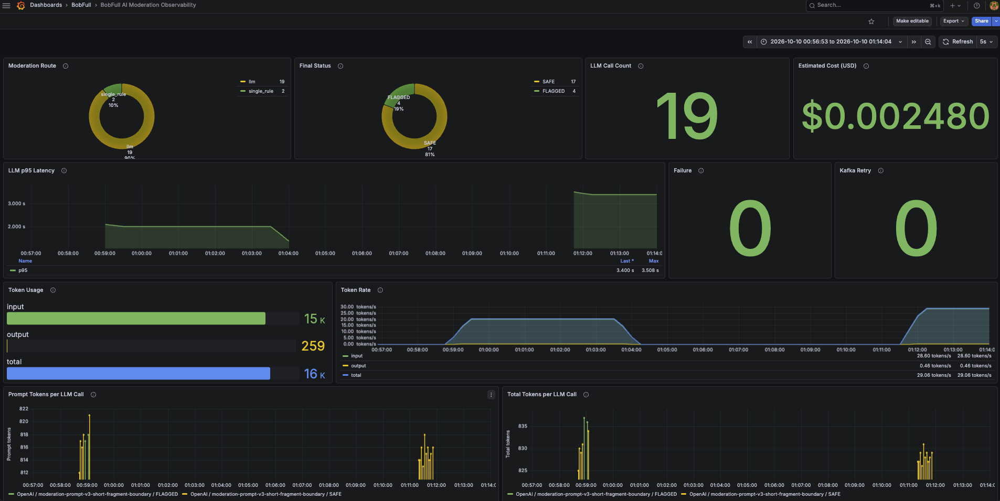

# Issue #49 LLM Observability Evidence

## 검증 대상

Issue #49는 AI Moderation의 분류 품질이나 Provider 호출 효율을 개선하는 작업이 아니다. 현재
`Rule → LLM → 결과 검증 → DB 저장 → Kafka Retry/DLT` 경로에서 업무 처리 경로, 최종 상태, 실패 단계,
Kafka Consumer retry와 Spring AI/OpenAI 호출 지표를 로컬에서 관측할 수 있도록 구성하고 검증한다.

이번 Evidence의 수치와 화면은 production/AWS 실측이 아니라 2026-10-10 로컬 개발 환경에서 수행한
소규모 수동 관측 샘플이다.

## 측정 계약

- Primary
  - `single_rule`, `split_rule`, `llm` 업무 route 수
  - 최종 DB 저장에 성공한 `SAFE`, `FLAGGED`, `ANALYSIS_FAILED` 수
  - `provider`, `parse`, `validation`, `persistence` 실패 단계
  - Kafka Consumer의 실제 재실행 횟수
- Secondary
  - Spring AI 논리 Provider 호출 수와 latency
  - Provider 응답의 input/output/total token
  - OkHttp 실제 HTTP attempt와 status
  - 로컬 MySQL `chat_moderation`에 저장된 실제 LLM 호출별 prompt/total token
  - token 합계와 공개 단가 가정으로 계산한 Estimated Cost
- 안전 확인
  - Metric 기록 실패는 Moderation 업무 흐름으로 전파하지 않는다.
  - messageId, eventId, chatRoomId, memberId, 원문과 예외 메시지를 metric tag로 사용하지 않는다.
  - Prompt, Rule, Policy, Model과 Spring AI/OpenAI/Kafka retry 정책을 변경하지 않는다.
  - 실제 OpenAI를 사용하는 evaluation은 재실행하지 않는다.

## 기준 코드와 환경

- 작업 브랜치: `feature/49-llm-observability`
- Before SHA: `ca9fcb8574aaef20c34e9363caa63c6a5caafed4`
- Implementation/After SHA: `<IMPLEMENTATION_COMMIT_SHA>`
- Implementation/After SHA는 구현·테스트·로컬 monitoring·최초 Evidence를 포함한 commit을 뜻한다.
  해당 SHA를 기록하는 후속 docs-only commit은 측정 코드와 결과를 변경하지 않는다.
- 애플리케이션: Mac host, local profile, `localhost:8080`
- Prometheus: `prom/prometheus:v3.14.0`, Docker, `localhost:9090`
- Grafana: `grafana/grafana:12.4.0`, Docker, `localhost:3000`
- MySQL: `mysql:8.4`, local Docker
- Prometheus scrape target: `host.docker.internal:8080/actuator/prometheus`
- Grafana dashboard UID: `bobfull-ai-moderation`
- Dashboard 기본 범위: 최근 15분, refresh 5초

## Before 결과

`NOT_APPLICABLE`. 이번 작업은 성능 개선 Before/After 비교가 아니라 운영 관측 수단 구축과 현재 상태
확인이다. Issue #48 Evaluation 수치와 이번 로컬 운영 관측 샘플도 실행 목적과 데이터가 다르므로 성능
개선 전후로 비교하지 않는다.

## 변경 내용

### BobFull Custom Metrics

| Metric | Type | Tags | 기록 시점 |
|---|---|---|---|
| `bobfull.ai.moderation.route` | Counter | `route`, `prompt_version`, `policy_version` | 실제 `single_rule`, `split_rule`, `llm` 경로 진입 시 |
| `bobfull.ai.moderation.failure` | Counter | `stage`, `prompt_version`, `policy_version` | provider/parse/validation/persistence 단계 실패 시 |
| `bobfull.ai.moderation.final.status` | Counter | `status`, `prompt_version`, `policy_version` | 최종 Moderation DB 저장 성공 후 |
| `bobfull.ai.moderation.kafka.retry` | Counter | 없음 | Kafka `deliveryAttempt > 1`인 Consumer 재실행 시 |

`ChatModerationMetrics`가 Counter 등록과 증가를 담당한다. MeterRegistry가 예외를 던져도 경고 로그만
남기고 Moderation 처리는 계속하는 fail-open 구조다. Kafka retry는 OpenAI SDK의 HTTP retry 및 기존 DLT
소진 metric과 분리한다.

### 기존 Runtime Metrics 재사용

Spring AI와 OpenAI SDK/OkHttp가 제공하는 다음 meter는 중복 custom metric을 만들지 않고 재사용한다.

| Meter | 확인 용도 |
|---|---|
| `spring.ai.chat.client` | ChatClient 논리 호출 latency/count |
| `gen_ai.client.operation` | Provider 논리 호출 count/latency 및 model/provider tag |
| `gen_ai.client.token.usage` | input/output/total token |
| `okhttp.requests` | 실제 HTTP attempt, status와 latency |

Fake OpenAI endpoint 통합 테스트에서 정상 응답은 논리 호출 1회/HTTP attempt 1회였고,
`429 → SDK retry → 200`은 논리 호출 1회/HTTP attempt 2회로 관측됐다. Provider retry 소진은 provider
failure 1회, Structured Output 변환 실패는 parse failure 1회로 각각 구분됐다.

`gen_ai.client.operation`에만 Prometheus histogram을 활성화해 p95 latency query에 필요한
`gen_ai_client_operation_seconds_bucket`을 노출한다. 전체 OkHttp 요청에는 별도 histogram 설정을 추가하지
않았다.

## Grafana Dashboard

Provisioning JSON으로 `BobFull AI Moderation Observability` dashboard를 고정 UID로 관리한다.

| Panel | Datasource | 관측 내용 |
|---|---|---|
| Moderation Route | Prometheus | route별 누적 처리 수 |
| Final Status | Prometheus | 최종 저장 성공 status별 수 |
| LLM Call Count | Prometheus | Spring AI 논리 Provider 호출 수 |
| Estimated Cost | Prometheus | token과 dashboard 계산식의 공개 단가 가정 기반 추정 USD |
| LLM p95 Latency | Prometheus | 선택 시간 범위의 5분 rate histogram p95 |
| Failure | Prometheus | 전체 및 stage별 실패 수 |
| Kafka Retry | Prometheus | Consumer 재실행 수 |
| Token Usage | Prometheus | input/output/total token 합계 |
| Token Rate | Prometheus | 5분 기준 token 처리율 |
| Prompt Tokens per LLM Call | Local MySQL | 실제 OpenAI DB row별 prompt token |
| Total Tokens per LLM Call | Local MySQL | 실제 OpenAI DB row별 total token |



위 화면은 **Local manual observation sample**이다. Dashboard가 장애 원인이나 효율화 효과를 증명하는
것은 아니며, 선택한 time range에 포함된 로컬 샘플만 보여준다.

### MySQL 기반 per-call token 패널

두 하단 패널은 `chat_moderation`의 `analyzed_at`, `provider`, `prompt_version`, `result`,
`prompt_tokens`, `total_tokens`만 조회한다. `provider = 'OpenAI'`와 token `IS NOT NULL` 조건으로 Fake 및
`BOBFULL_RULE` 행을 제외한다. Dashboard time picker의 `$__timeFilter(analyzed_at)`를 적용하고 각 DB row를
시간축의 개별 호출로 표시한다.

Prompt token query:

```sql
SELECT
  analyzed_at AS time,
  prompt_tokens AS value,
  CONCAT(provider, ' / ', prompt_version, ' / ', result) AS metric
FROM chat_moderation
WHERE $__timeFilter(analyzed_at)
  AND provider = 'OpenAI'
  AND prompt_tokens IS NOT NULL
ORDER BY analyzed_at ASC;
```

Total token query는 같은 조건에서 `prompt_tokens` 대신 `total_tokens`를 사용한다. Query와 panel 결과에는
messageId, memberId, chatRoomId, 원문을 포함하지 않는다.

## 실제 로컬 관측 결과

아래는 2026-10-10 캡처 시점의 **로컬 수동 관측 샘플**이다.

| 항목 | 관측값 |
|---|---:|
| Moderation Route | `llm=19`, `single_rule=2` |
| Final Status | `SAFE=17`, `FLAGGED=4` |
| LLM Call Count | 19 |
| Input / Output / Total token | 15,496 / 259 / 15,755 |
| Estimated Cost | 약 `$0.002480` |
| Failure | 0 |
| Kafka Retry | 0 |
| OpenAI row별 Prompt token | 812~821 |
| OpenAI row별 Total token | 825~837 |

Estimated Cost는 dashboard 계산식의 `gpt-4o-mini` input `$0.15`/1M tokens, output `$0.60`/1M
tokens 가정을 적용한 값이며 실제 청구 비용이 아니다. cache discount, Provider 청구 상세, retry attempt별
사용량을 독립적으로 계산한 값도 아니다.

LLM p95 latency는 Dashboard time range와 5분 rate window에 따라 바뀌므로 단일 숫자를 전체 결과로
일반화하지 않는다.

## 관측 결과에서 확인된 점

1. BobFull 업무 route와 최종 DB 상태를 Spring AI Provider metric과 분리해 확인할 수 있다.
2. 논리 LLM 호출과 SDK 내부 실제 HTTP attempt를 서로 다른 meter로 구분할 수 있다.
3. 로컬 샘플 19회의 prompt token이 812~821 범위에 반복됐다.
4. 이 per-call 패턴과 현재 매 호출마다 System Prompt를 포함하는 코드 구조를 함께 보면 Prompt
   minimization, 호출 구조 개선, micro-batching은 이후 비교 실험의 후보가 될 수 있다.
5. 4번은 효율화 효과가 확인됐다는 뜻이 아니다. 같은 조건의 Before/After 측정은 별도 작업에서 수행해야
   한다.

## 회귀 및 구성 검증

```bash
./gradlew :test \
  --tests 'com.bobfull.chat.application.service.ChatModerationServiceTest' \
  --tests 'com.bobfull.chat.application.service.ModerationRulePolicyTest' \
  --tests 'com.bobfull.chat.infrastructure.ai.FakeAiModerationAdapterTest' \
  --tests 'com.bobfull.chat.infrastructure.ai.AiModerationPortSelectionTest' \
  --tests 'com.bobfull.chat.infrastructure.ai.ModerationOpenAiOptionsTest' \
  --tests 'com.bobfull.chat.infrastructure.ai.ModerationPromptTest' \
  --tests 'com.bobfull.chat.infrastructure.ai.SpringAiRuntimeMetricsIntegrationTest' \
  --tests 'com.bobfull.chat.infrastructure.kafka.ChatModerationConsumerMetricTest' \
  --tests 'com.bobfull.chat.infrastructure.metrics.ChatModerationMetricsTest' \
  --rerun-tasks

./gradlew clean build
jq empty ops/local-monitoring/grafana/provisioning/dashboards/bobfull-ai-moderation-observability.json
docker compose -f docker-compose.monitoring.yml config --quiet
git diff --check
```

- Targeted: 48 tests, skipped 0, failures 0, errors 0
- 전체 root + Lambda: 974 tests, skipped 64, failures 0, errors 0
- `BUILD SUCCESSFUL`
- Dashboard JSON syntax: PASS
- Panel ID uniqueness: PASS (`Estimated Cost=12`, `Prompt Tokens=11`, `Total Tokens=13`)
- Docker Compose config: PASS
- Grafana dashboard provisioning: PASS (`starting to provision dashboards` → `finished to provision dashboards`)
- Prometheus `bobfull-backend` target: `UP`, last error 없음
- Local MySQL datasource: 실제 OpenAI 19개 row의 per-call token panel 렌더링 확인
- `git diff --check`: PASS

최초 targeted 명령은 `--tests` filter가 Lambda subproject에도 적용되어 해당 subproject의 `No tests found`로
종료됐다. 같은 목록을 root `:test` task로 한정해 재실행한 결과가 위 48건 PASS이며, 이후 전체
`clean build`에서도 root와 Lambda가 모두 통과했다.

Grafana startup log에는 사용하지 않는 optional `plugins`, `alerting` provisioning directory가 없다는 경고가
남지만, dashboard provisioning 완료와 Prometheus/MySQL panel 렌더링에는 영향을 주지 않았다.

## 한계 및 주의사항

- production/AWS traffic과 장기 운영 부하를 측정하지 않았다.
- 표본은 로컬 수동 입력으로 생성한 19회의 LLM 호출이며 품질·비용·latency 모집단을 대표하지 않는다.
- Counter는 현재 애플리케이션 프로세스 생명주기의 누적값이다.
- p95는 선택한 Dashboard 시간 범위와 scrape/rate window의 영향을 받는다.
- MySQL datasource와 하단 per-call panel은 local monitoring 전용이다.
- Metric tag는 낮은 cardinality로 제한했으며 개별 message correlation은 structured log/trace의 별도 책임이다.
- Grafana 화면과 token 반복만으로 원인을 단정하거나 Prompt 경량화/micro-batching 효과를 주장할 수 없다.

## 다음 단계

Issue #49에서는 관측 수단과 로컬 Baseline 확인까지만 수행한다. Prompt 경량화, 호출 구조 개선,
micro-batching 등은 별도 Issue에서 필요성과 안전 경계를 정한 뒤, 동일 조건의 Before/After 품질·latency·token·
비용을 재측정한다.

## 관련 자료

- Issue #47: AI Moderation 현재 구조 및 Baseline Audit
- Issue #48: AI Moderation Evaluation 체계 및 Policy v2 Baseline
- Issue #49: LLM Observability
- Dashboard JSON: `ops/local-monitoring/grafana/provisioning/dashboards/bobfull-ai-moderation-observability.json`
- Screenshot SHA-256: `f806c550141125e547f6e96e1f576b06994df1edb7eee3778e3a77f10b56d0e0`
